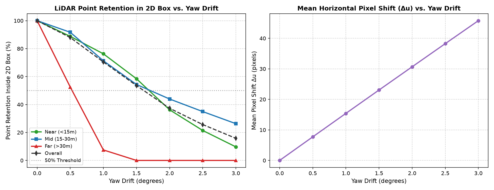
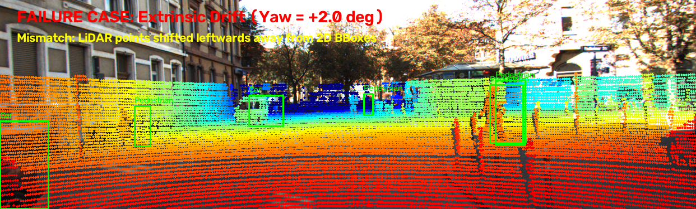

# Báo cáo Day 6: Đánh giá độ nhạy LiDAR-Camera Projection với Calibration Drift

- **Họ tên:** Vương Việt Hoàng
- **MSSV:** 2A202602528
- **Lớp:** AI20K - Track 4
- **Link repo:** https://github.com/VietHoang04-sys/VuongVietHoang-2A202602528-Track4-Day21
- **Topic:** A — LiDAR-camera projection QA
- **Dataset:** data/synthetic, data/kitti_mini, data/nuscenes_mini_subset
- **Các frame đã dùng:** 000000, 000011, scene-0103_010

## 1. Claim

Độ lệch góc xoay extrinsic (yaw drift) từ 1.0° trở lên khiến tỷ lệ điểm LiDAR chiếu trúng vào 2D bounding box của đối tượng giảm trên 25% ở cự ly trung bình (15–30 m) và sụt giảm nghiêm trọng trên 60% ở cự ly xa (>30 m), dẫn đến hiện tượng trượt điểm (mismatch) nghiêm trọng giữa điểm 3D và đối tượng 2D trên ảnh camera.

## 2. Evidence

Thực nghiệm đo đạc tỷ lệ giữ lại điểm (Point Retention Ratio) của các đối tượng trong 2D bounding box chuẩn (Ground Truth) khi quét góc lệch yaw từ 0.0° đến 3.0° trên KITTI frame 000011 (file `results/calibration_drift_benchmark.csv`):

| Mức Perturb (Yaw) | Retention Gần (<15m) | Retention Vừa (15–30m) | Retention Xa (>30m) | Tổng thể | Lệch ngang Δu | Ghi chú |
|---|---|---|---|---|---|---|
| 0.0° (Chuẩn) | 100.0% | 100.0% | 100.0% | 100.0% | 0.0 px | Khớp hoàn hảo |
| 0.5° | 88.8% | 91.7% | 52.5% | 87.9% | 7.7 px | Vật xa mất gần 50% điểm |
| 1.0° | 76.3% | 71.3% | 7.5% | 70.5% | 15.4 px | Vật xa mất 92.5% điểm |
| 1.5° | 58.4% | 54.3% | 0.0% | 53.5% | 23.1 px | Vật xa mất hoàn toàn |
| 2.0° | 36.2% | 43.9% | 0.0% | 37.3% | 30.7 px | Lệch nặng trên mọi cự ly |
| 3.0° | 9.7% | 26.3% | 0.0% | 15.8% | 45.8 px | Điểm trượt ra ngoài đối tượng |

**Bonus B3 (Đo latency p50/p95 qua 30 lần lặp, bỏ warmup):** Đo trên CPU với 108,004 điểm đạt p50 = 5.67 ms, p95 = 8.31 ms (~176 FPS), chi tiết lưu tại `results/projection_latency.csv`.  
**Bonus B5 (So sánh đa cảm biến KITTI vs nuScenes):** KITTI 64-beam (~108k điểm) có mật độ dày, bao phủ 18.5% FOV, nhận diện biên vật thể rõ ràng; nuScenes 32-beam (~35k điểm) thưa hơn (9.0% FOV) và yêu cầu bắt buộc phải bù chuyển động xe (ego-motion) giữa các timestamp (chi tiết trong `results/dataset_comparison.csv`).




## 3. Failure case

Khi ngoại thông số calibration bị lệch góc yaw từ 2.0° trở lên, toàn bộ chùm tia LiDAR bị xoay ngang làm điểm 3D của ô tô (khoảng cách 27.2 m) và người đi bộ (khoảng cách 34.2 m) bị dịch lệch sang trái hơn 30 pixel, rơi hoàn toàn ra ngoài 2D bounding box và gán nhầm vào mặt đường/nhà dân phía sau.



- **Lớp debug:** Thuộc lớp **Geometry (Hình học)** — Sai lệch ma trận biến đổi toạ độ ngoại thông số Tr_velo_to_cam [R | t] giữa hệ toạ độ Velodyne và Camera.
- **Nguyên nhân gốc & Khắc phục:** Va chấn cơ học hoặc rung lắc giá đỡ cảm biến (sensor bracket). Trên xe thật, cần chạy module giám sát online calibration (kiểm tra tương quan biên ảnh Canny và depth edge) để kích hoạt chế độ an toàn (fail-safe) khi drift vượt quá 0.5°.

## 4. Khuyến nghị nếu triển khai thật

- **Use-case ADAS / Xe tự hành:** Thuật toán camera-LiDAR fusion (như BEVFusion, PointPainting, hoặc gán nhãn tự động 3D-to-2D).
- **Đánh đổi (Trade-offs):**
  - Tốc độ vs Tài nguyên: Phép chiếu ma trận thuần túy có độ trễ cực thấp (p50 = 5.67 ms, throughput >170 FPS trên CPU), hoàn toàn đáp ứng thời gian thực cho luồng LiDAR 10–20 Hz mà không chiếm dụng tài nguyên GPU của model perception.
  - Dung sai an toàn: Ở cự ly xa (>30 m), sai lệch góc yaw dù chỉ 1.0° đã gây mất 92.5% điểm đối tượng. Do đó, hệ số dung sai cơ khí của bracket cảm biến phải được thiết kế dưới 0.3°.
- **Chỉ số cần ghi log khi chạy thật:** Tỷ lệ điểm LiDAR trong FOV camera (`fov_pct`), điểm LiDAR nhất quán về depth với 2D detection proposals, và gradient alignment score giữa biên camera và biên đám mây điểm.

## 5. Cách chạy lại

Các lệnh tái tạo lại toàn bộ kết quả từ repo sạch:

```bash
# 1. Kích hoạt môi trường và kiểm tra dữ liệu
.venv\Scripts\activate
python tools/verify_data.py --data-root data/kitti_mini
python tools/verify_data.py --data-root data/nuscenes_mini_subset

# 2. Chạy baseline projection demo (CP2)
python -m starter.projection --data-root data/kitti_mini --frame 000011
python -m starter.projection --data-root data/synthetic --frame 000000
python -m starter.projection --data-root data/nuscenes_mini_subset --frame scene-0103_010

# 3. Chạy benchmark sweep drift, latency, đa dataset và sinh đồ thị + failure case (CP3, CP4)
python src/benchmark_projection_drift.py --data-root data/kitti_mini --frame 000011

# 4. Kiểm tra điều kiện nộp bài
python tools/check_submission.py
```

## 6. Khai báo sử dụng AI

| Công cụ | Dùng cho việc gì | Bạn đã kiểm chứng thế nào |
|---|---|---|
| AI Assistant (Antigravity) | Gợi ý cấu trúc script benchmark, tối ưu hoá vector hoá NumPy cho phép chiếu toạ độ đồng nhất và vẽ biểu đồ | Tự kiểm chứng công thức hình học chiếu toạ độ pinhole, chạy test độc lập từng hàm trên dữ liệu mẫu frame 000000, đối chiếu pixel (u, v) và độ sâu z khớp chính xác với lý thuyết |
